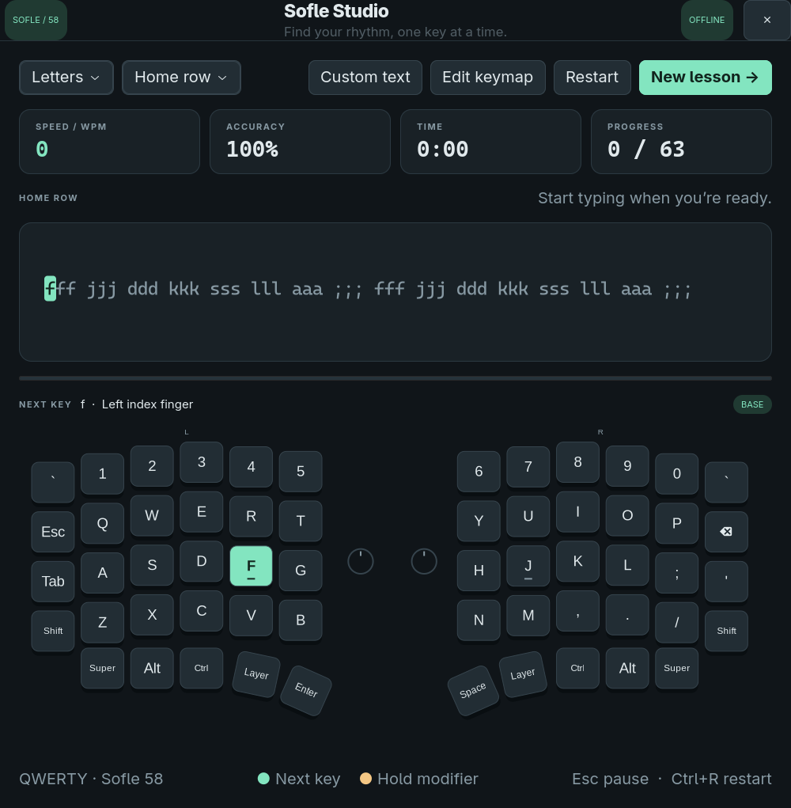

# Sofle Studio — native Linux app

A native, offline Linux typing trainer for a **58-key Sofle**. Practice text sits
above a split, column-staggered keyboard. The next character lights up its key;
Shift and symbol-layer buttons light up when a chord is needed.



## Install on Omarchy / Arch Linux

Sofle Studio runs directly from this folder. No build, Python virtual environment,
pip packages, background service or system-wide app installation is required.
It needs Python 3, GTK 4, PyGObject and Cairo.

1. Install any missing dependencies using the system package manager:

   ```sh
   sudo pacman -S --needed python gtk4 python-gobject python-cairo
   ```

   All four dependencies were already installed on the machine where this app
   was created. The command above skips packages that are already up to date.

2. From the parent project folder, enter the native app folder:

   ```sh
   cd linux_app
   ```

3. Make the launcher executable if its permissions were lost when copying the
   project, then launch the app:

   ```sh
   chmod +x run.sh
   ./run.sh
   ```

Keep this folder in a location you can write to: saved settings and results are
stored alongside the app. You can move or copy the whole folder elsewhere and
run its `run.sh` there.

## Run after installation

From inside `linux_app`:

```sh
./run.sh
```

Or from the parent project folder:

```sh
./linux_app/run.sh
```

The launcher locates the app relative to itself, so it also works when called
using an absolute path. Run it in your graphical desktop session; it needs an
available Wayland or X11 display. A KDE desktop is not required.

The app works offline. Dependency installation may need an internet connection.

## Match your keyboard

The starting **QWERTY** preset follows the stock QMK Sofle keymap, the same
default as the web app: its base layer, thumb keys, and LOWER layer as the
symbol layer. An alternative Colemak-DH preset uses the same thumb keys and
symbol layer. If your firmware differs, edit the keymap to match it.

1. Choose **Edit keymap**.
2. Click a key on the diagram.
3. Enter its base character, shifted character and optional symbol-layer
   characters. Use `SPACE`, `ENTER` or `TAB` for those keys.
4. Set its role: Character, Shift, Layer, Backspace, Control, Alt or Super.
5. Use **Update selected key** before moving to another key, then **Save keymap**.

The editor changes the guide only; it does not reprogram your Sofle. Give a
tap-hold key the role corresponding to what you want to practise: Character for
its tap output, or a modifier role for its hold behavior. This first version
models one symbol layer and Shift; it does not model multiple layers, combos,
macros or simultaneous tap-and-hold roles. Its diagram approximates Sofle
geometry and includes decorative encoders, not an exact PCB rendering.

The app receives characters from Linux. It can guide the chord represented in
your keymap, but it cannot verify which physical switch, finger or firmware
layer produced a character. Configure your existing keyboard firmware to
produce the characters you expect; this app performs no layout emulation.

## Practice

- **Letters:** home, upper, lower row or all letters, using your saved keymap.
- **Words:** common English words.
- **Sentences:** capitalization and punctuation.
- **Symbols:** numbers, brackets and punctuation.
- **Custom text:** paste your own sentences or code, including line breaks.

Click the practice text and start typing. Mistakes stay on the current
character until you press it correctly. Red feedback marks an error; green
marks the next key; amber marks a modifier to hold. Finger guidance is shown
above the keyboard. Backspace rewinds one correctly typed character. Press
**Esc** to pause, **Ctrl+R** to restart, and **Enter** after finishing to start
the next lesson. Switching away from the app pauses the timer automatically.

WPM is completed characters divided by five, per active minute. Accuracy counts
all character attempts, including retries. Backspacing does not erase error
history. The timer starts with your first character and stops on completion.

The keymap and the last 100 completed sessions are saved locally in
`.data/keymap.json` and `.data/history.json` beside the app. The history includes
per-character attempt counts for reviewing which letters need practice.

To preserve your keymap and progress when moving the app, copy the `.data`
folder too. It is hidden in most file managers. It is created when a keymap or
completed session is saved.

## Uninstall

There is no system-installed app, desktop launcher, service or server to remove.

1. Close Sofle Studio.
2. If you want to retain your keymap and history, copy `linux_app/.data` to a
   backup location before deleting the app folder.
3. From the **parent project folder**, delete the native app folder:

   ```sh
   rm -r -- linux_app
   ```

This removes the source, launcher, tests, preview, caches and any saved settings
and history inside that folder. If you copied the app elsewhere, remove that
copy instead.

Python, GTK 4, PyGObject and Cairo are shared system dependencies. Removing this
app does not require removing them; other desktop applications may use them.

To reset only the app's saved settings and history while keeping the app, close
it and run this from inside `linux_app`:

```sh
rm -r -- .data
```

Run that reset command only if `.data` exists. The app will use the default
QWERTY keymap next time.

## Project files

```text
linux_app/
├── app.py                 GTK interface and native UI checks
├── trainer.py             Typing logic, lessons and keymaps
├── run.sh                 App launcher
├── README.md              Installation and usage instructions
├── preview.png            App screenshot
├── tests/test_trainer.py  Automated logic tests
├── .gitignore             Excludes local data and Python caches
└── .data/                 Local settings and history (created on use)
```

## Verify

From inside `linux_app`:

```sh
python3 -m unittest discover -s tests -v
./run.sh --smoke-test
```

The smoke test opens a temporary window, exercises native UI flows, saves a
preview to `/tmp/sofle-studio-preview.png`, and exits. It uses temporary settings
and leaves your saved keymap and practice history alone.

## Troubleshooting

- **Missing `gi`, GTK or Cairo:** install the dependencies listed above and run
  `./run.sh`. The launcher uses `/usr/bin/python3`, matching Arch's system
  packages, rather than a virtual environment or another Python installation.
- **No display / window does not open:** launch from a terminal in your Linux
  desktop session, rather than a headless SSH session.
- **Permission denied for `run.sh`:** run `chmod +x run.sh` in this folder.
- **Highlighted keys differ from your Sofle:** use **Edit keymap** to match your
  actual firmware mapping, especially thumb keys and symbols.
- **Settings or results cannot be saved:** check that this folder is writable
  by your user. Launch the app as your normal desktop user, without `sudo`.
